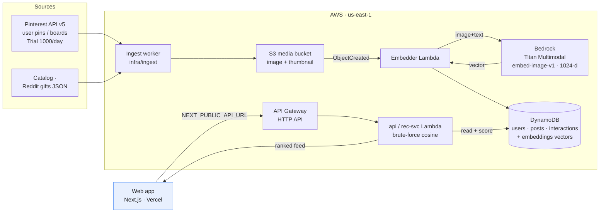
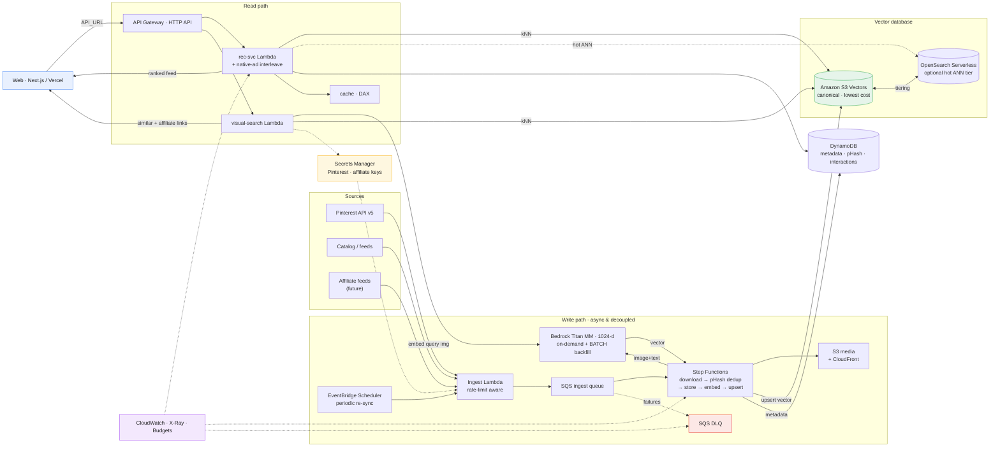

# CLOUD.md — Giftmaxxing image → vector → feed pipeline

> **What this file is.** The canonical cloud/AWS spec **and** agent memory for the
> Pinterest-image ingestion, multimodal embedding, vector indexing, recommendation,
> native-ad simulation, and (future) visual-search work. It is the "cloud" analog of
> `CLAUDE.md`: Claude Code and Devin/Cascade should treat **§8 Roadmap** as the working
> backlog for this initiative. Keep it updated as decisions land.
>
> **Audience.** Future coding agents + humans. Everything needed to *start building*
> without re-doing the research is here. Prices marked _(verify)_ are list prices that
> drift — re-check the linked AWS page before committing spend.
>
> **Repo facts.** Monorepo. `web/` = Next.js app (deploys to Vercel via GitHub).
> `infra/` = Terraform serverless backend (DynamoDB + Lambda + API Gateway HTTP API),
> **deployed** in `us-east-1`, account `445056752928`. API base:
> `https://tvyu8gqmki.execute-api.us-east-1.amazonaws.com`.
>
> **✅ Verified (live, AWS acct `445056752928` / `us-east-1`, Jun 2026):** Bedrock
> **Titan Multimodal access is GRANTED** (test invoke of `amazon.titan-embed-image-v1`
> returned a 1024-d vector). **Amazon S3 Vectors is available** in the account
> (`s3vectors list-vector-buckets` ok). **Pricing confirmed** via the AWS Price List API
> — see §7. Architecture diagrams in §11.

---

## 0. TL;DR — the decisions

| Concern | Decision | Why |
|---|---|---|
| **Embedding model** | Amazon Bedrock — **Titan Multimodal Embeddings G1** (`amazon.titan-embed-image-v1`), 1024-d (also 384/256) | Single **shared** text+image vector space → enables image↔image *and* text↔image search with one model. No servers to run, pay-per-call. |
| **Forward option** | **Amazon Nova Multimodal Embeddings** (newer, unified text/image/video/audio) | Migration target once stable; same pipeline shape. |
| **Image storage** | **Amazon S3** (private bucket, `s3:image/...`) | Cheap, event-driven, native Bedrock/OpenSearch integration. |
| **Vector database (recommended)** | **Amazon S3 Vectors** — ✅ confirmed available in acct `445056752928`/`us-east-1` | The AWS-native, purpose-built vector store: lowest TCO, scales past 100k, native Bedrock + OpenSearch integration. Use as the canonical index. See §11 for the full options list. |
| **Vector index (Phase-1 alt)** | Brute-force cosine in Lambda over vectors in DynamoDB | Zero-dependency fallback at ≤ ~10k vectors; ~$0 extra. Only if avoiding S3 Vectors. |
| **Vector index (scale/low-latency)** | OpenSearch Serverless vector engine **or** Aurora PostgreSQL Serverless v2 + `pgvector` | Only when ANN latency/filtering at >100k vectors justifies the monthly minimum. |
| **Pinterest** | API v5, OAuth 2.0, **user-scoped content only** | Pull a connected user's own pins/boards as a taste signal + idea images. No global image firehose exists in the API. |
| **Native ads** | Reuse `PostCard`, add `sponsored` flag, subtle "Sponsored" label, interleave at a cadence, **rank by the same taste vector** | Reproduces Pinterest's "I can't tell it's an ad" seamlessness. |
| **Cost at dev scale** | **≈ a few $/month** (pricing ✅ verified via AWS Price List) | Embedding 10k images ≈ **$0.60 one-time** on-demand (**$0.30 batch**); S3 pennies/mo; Bedrock has no idle cost. |

---

## 1. Pinterest ingestion

### 1.1 Rate limits (confirmed from Pinterest docs)
Source: <https://developers.pinterest.com/docs/reference/rate-limits/>

- **Trial access:** **1,000 requests / day**, across **all** endpoints combined. (Default tier when you create an app.)
- **Standard access:** **100 requests / second**, per user, per app, across all endpoints. (Granted after app review/upgrade.)
- Every response carries rate-limit headers — **read these and back off**, don't hard-code limits:
  - `x-ratelimit-limit` — e.g. `100, 100;w=1, 1000;w=60` (≈ 100/sec burst window `w=1`, 1000/min window `w=60` for Standard).
  - `x-ratelimit-remaining` — calls left in the current window.
  - `x-ratelimit-reset` — seconds until the window resets.
- Some endpoint families (e.g. `ads_analytics`, `catalogs_*`, `trends_read`) have their **own** category limits; request increases via a Pinterest support ticket.
- **Access tiers:** <https://developers.pinterest.com/docs/key-concepts/access-tiers/> — Trial also restricts created Pins/Boards (sandbox-like) and can deny requests outside the trial scope.

**Implication for us:** Trial's 1,000/day is plenty to onboard a connected user's boards/pins for taste signals. A page of 100 pins = 1 request, so a user with 2,000 saved pins ≈ 20 requests. Batch onboarding of many users at once needs Standard access + a queued, header-aware ingestion worker.

### 1.2 Auth & access model
- **OAuth 2.0** authorization-code flow. Store `PINTEREST_CLIENT_ID` / `PINTEREST_CLIENT_SECRET`; redirect via `PINTEREST_REDIRECT_URI`.
- Relevant **scopes** (read-only): `user_accounts:read`, `boards:read`, `pins:read`. (Add `:write` only if we ever create pins.)
- **Critical constraint:** Pinterest API v5 exposes the **authenticated user's own content** (their pins/boards) plus ads/catalog endpoints. **There is no public "search all of Pinterest" image firehose.** So the realistic product flow is exactly the app's existing copy — *"Link a Pinterest board or recent saves so Maxi learns each person's taste."* Idea images in the feed come from **connected users' own boards** (with rights) and/or **our own catalog**, not scraped global content.
- **Terms / rights / privacy:** honor the Pinterest Developer Guidelines + data-retention/deletion obligations. Prefer to **store image URLs + a small cached thumbnail + a perceptual hash**, not full-resolution redistribution. Delete a user's derived data on disconnect.

### 1.3 Endpoints we use
Base: `https://api.pinterest.com/v5`

| Method | Path | Purpose |
|---|---|---|
| GET | `/user_account` | Connected profile |
| GET | `/boards` | List the user's boards (cursor paginated) |
| GET | `/boards/{board_id}/pins` | Pins on a board |
| GET | `/pins` | List the user's pins |
| GET | `/pins/{pin_id}` | A single pin → includes `media.images` |
| GET | `/search/pins?query=` | Search the **user's own** pins |

- **Pagination:** cursor-based via the `bookmark` query param; `page_size` up to 100.
- **Pin `media.images`** comes in sizes: `150x150`, `400x300`, `600x`, `1200x`, `originals` — each `{ url, width, height }`. Use `600x`/`1200x` for embedding, `150x150` for the cached thumbnail.
- **What we extract per pin:** `id`, best image `url`, `title`/`description`/`alt_text` (text side of the embedding), `board`, destination `link`, dominant color, dimensions.

### 1.4 Query filters (what the API can actually filter on)
User-scoped only — **no global search**. Available filters:
- **`/boards`** — `page_size` (1–250), `bookmark`, `privacy` = `ALL|PUBLIC|PROTECTED|SECRET`.
- **`/pins`** — `page_size`, `bookmark`, `creative_types` = `REGULAR,VIDEO,SHOPPING,CAROUSEL,MAX_VIDEO,SHOP_THE_PIN,COLLECTION,IDEA`, `pin_filter=exclude_native`, `include_protected_pins`, `pin_metrics`.
- **`/boards/{id}/pins`** — same `creative_types` + pagination; plus board **sections**.
- **`/search/pins?query=` / `/search/boards?query=`** — free-text over the **user's own** content only.
- **No server-side date filter** — pins carry `created_at`; filter client-side.
- Merchant **`/catalogs/*`** endpoints add product-feed filters (only if we run a catalog).

### 1.5 Status & the public-RSS scraper (✅ IMPLEMENTED)
- **⛔ v5 content API is blocked for our app:** the token-shaped `PINTEREST_API_KEY` returns **HTTP 401 `{"code":3,"message":"Your application consumer type is not supported, please contact support."}`** on `/v5/user_account` and `/v5/boards`. This is an **app-approval / consumer-type** problem on Pinterest's side (needs Standard access / correct app type), not a code bug. OAuth isn't wired yet (no `CLIENT_ID/SECRET`).
- **✅ Fallback in use — public RSS (no auth):** Pinterest still serves `https://www.pinterest.com/<user>/feed.rss` and `…/<user>/<board>.rss` (verified HTTP 200, valid RSS). Each `<item>` → pin `<link>`, `<title>`, `<pubDate>`, and `` inside `<description>`; we upgrade `236x → originals` for full-res.
- **Scraper:** `infra/ingest/pinterest-rss.mjs` — fetch feeds → parse → download → upload to **S3** (`MEDIA_BUCKET`, key `images/pin-<id>.jpg`, ASCII metadata) → write `pins.manifest.json`. Flags: `--users a,b`, `--boards user/board`, `--limit`, `--skip-existing`, `--dry-run`, `--bucket`, `--prefix`. Run: `set -a; source ../../.env; set +a` then `npm run scrape:pinterest -- --users etsy,marthastewart`.
- **First run (Jun 2026):** 72 pins from `etsy,marthastewart,uncommongoods` → **`s3://giftmaxxing-dev-media/images/` (72 objects, ~10 MiB, image/jpeg)**. Idempotent via `--skip-existing`.
- **Limitations:** public boards only, ~25 recent pins/feed, less metadata than the API. Swap to the official API (OAuth) once the app is approved — the embed/S3 steps are identical.

---

## 2. Embedding on AWS

### 2.1 Model: Titan Multimodal Embeddings G1 (Bedrock)
- Model id: `amazon.titan-embed-image-v1`. Call via Bedrock `InvokeModel`.
- **Input:** an image (base64) and/or a text string. **Output:** one float vector in a **shared** space — default **1024 dims** (request `256` or `384` for cheaper storage/faster search via `embeddingConfig.outputEmbeddingLength`).
- **Why shared-space matters:** the same model embeds *both* the product/idea image *and* a text query (e.g. "warm cozy film-camera vibe"). So we get, for free:
  - **image → image** ("more like this pin"),
  - **text → image** (taste words → matching images),
  - **image → product** (the future visual search).
- **Input limits (verify in model docs):** image ≤ ~25 MP / a few MB after base64; long text is truncated to the model's token cap. Downscale to ≤1024px before sending.
- Request shape (illustrative):
  ```json
  { "inputImage": "<base64>", "inputText": "matcha starter kit, cozy kitchen",
    "embeddingConfig": { "outputEmbeddingLength": 1024 } }
  ```
  Response: `{ "embedding": [ ...1024 floats... ] }`.
- **Newer alternative:** Amazon **Nova Multimodal Embeddings** — same idea, broader modalities; treat as the migration target. Cohere Embed (Image) v3 is also on Bedrock.

### 2.2 Pipeline (ingest → embed → store)
```
Pinterest API ─┐
our catalog   ─┼─▶ S3 (raw/derived image)  ──(S3:ObjectCreated)──▶  Lambda "embedder"
affiliate feed ┘                                                          │
                                          Bedrock InvokeModel (Titan MM)  │
                                                          ▼               ▼
                                   vector + metadata ──▶ DynamoDB (Phase 1)  /  S3 Vectors (Phase 2)
```
- **Real-time:** S3 put event → `embedder` Lambda → Bedrock → write `{id, vector, dims, source, hash, tags, link}` to the vector store + a row in `posts`/`images`.
- **Backfill:** a batch script mirroring `infra/ingest/ingest.mjs` (read JSON → embed in chunks → BatchWrite). For large one-shot backfills use **Bedrock batch inference** (async, cheaper).
- **Dedup:** perceptual hash (pHash) before embedding to skip near-duplicate pins.

---

## 3. Storage & indexing

### 3.1 S3 (images)
- Private bucket `giftmaxxing-<env>-media`, keys `image/{sha256}.jpg` + `thumb/{sha256}.jpg`.
- Serve to the web app via CloudFront or pre-signed URLs (or just keep Pinterest's CDN URL + our thumbnail if rights require).

### 3.2 DynamoDB (Phase 1 vector home + metadata)
Add an `embeddings` table (or extend `posts`):
- PK `itemId`; attributes: `vector` (list<number> or binary), `dims`, `source` (`pinterest|catalog|affiliate`), `ownerId` (for user-scoped pins), `pHash`, `tags`, `link`, `createdAt`.
- GSI `bySource` for backfills/filtered scans.

### 3.3 Vector index — phased
| Phase | Approach | When | ~Cost |
|---|---|---|---|
| **1 — now** | **Brute-force cosine in Lambda.** Load candidate vectors from DynamoDB (or one Parquet/JSON blob in S3) into memory, compute cosine, top-k. | ≤ ~10k–100k vectors | **~$0** beyond DynamoDB storage (pennies) |
| **2 — managed-cheap** | **Amazon S3 Vectors.** Put vectors to a vector bucket/index; query top-k. Native Bedrock + OpenSearch integration. | 100k–10M+, infrequent queries | storage/GB + per-query _(verify)_ — lowest TCO of the managed options |
| **3 — low-latency ANN** | **OpenSearch Serverless** vector engine *or* **Aurora PG Serverless v2 + pgvector** | real-time filtered ANN at scale | OpenSearch Serverless has a **monthly minimum** (OCU-based, ~$350+/mo for 2-OCU dev/test, historically ~$700 with redundancy) _(verify)_ — **avoid until scale justifies it** |

Start at Phase 1 (zero new spend, fits current infra). Promote to Phase 2 (S3 Vectors) when the catalog crosses tens of thousands of items.

---

## 4. Recommendation feed integration

Today the ranker (`web/lib/recommend.ts`, mirrored server-side in `infra/src/handler.mjs`) builds a taste vector over **hand-tagged "vibes"**. The embedding pipeline upgrades this without changing the feed UI:

- **Taste vector → embedding centroid.** Instead of (or blended with) vibe weights, compute the **mean embedding of the items the user liked/saved** (and a discounted mean of followed authors' items). That centroid *is* the taste vector.
- **Candidate scoring.** For each candidate (catalog product, embedded Pinterest idea pin, or sponsored item), score = **cosine(taste centroid, candidate embedding)**, then blend with the existing price-fit / social-proof / follow signals (keep the `W` weights, swap the `taste` term).
- **"Photo ideas" cards.** Embedded Pinterest pins surface in the feed as inspiration cards ("photo ideas") ranked by the same cosine — they need not be buyable; tapping can deep-link to the source or to similar buyable products (see §6).
- **Server move.** This is the `rec-svc` upgrade: `GET /recommendations` queries the vector index (Phase 1 brute-force now) instead of the random/likes placeholder in `handler.mjs`.

---

## 5. Native (seamless) ads — Pinterest-style

### 5.1 What makes Pinterest ads feel organic (the pattern to copy)
- **Same card, same grid.** A Promoted Pin uses the **exact same component** as an organic Pin — same image-first layout, aspect ratios, hover/tap behavior. No banner, no separate "ad slot" chrome, no different background.
- **Minimal disclosure.** The only tell is a small, low-contrast **"Promoted" / "Promoted by {advertiser}"** label (muted text near the attribution), plus a `…` menu with **"Why am I seeing this ad?"** / hide. No loud "AD" badge.
- **Relevance-placed.** Ads are interleaved into the organic feed at intervals and chosen by the **same relevance/taste model**, so the sponsored item matches the surrounding vibe — that's *why* it's hard to distinguish.
- **Same interactions.** Save / click / comment / hide work identically; hiding feeds "fewer ads like this." CTA ("Visit"/"Shop") appears on closeup/hover, not as an intrusive grid button.

### 5.2 Giftmaxxing implementation
- Extend `Post` (`web/lib/social.ts`): `sponsored?: boolean; advertiser?: string; cta?: "Shop" | "Visit"`.
- Render in `PostCard` (`web/components/app/post-card.tsx`) using the **same card**; in the header slot where `rec` shows `Suggested · {reason}`, show a muted **`Sponsored`** (+ optional `· {advertiser}`) and a `…` → "Why am I seeing this?". Reuse the existing product chip as the subtle CTA.
- **Interleave** sponsored items in `recommendPage()` at a fixed cadence (e.g. 1 in every 5–6 posts) **but rank them by the same taste centroid** so they match the user's vibe. Apply a frequency cap and respect "hide."

---

## 6. Visual search — "Google Lens for gifts" (FUTURE, indexed for later agents)

> **Status: future / not built yet.** Documented + indexed here so a later agent can pick it up.

**Goal.** User uploads/snaps a photo → we return **visually similar, buyable products with Amazon/Walmart affiliate links** (à la Google Lens).

**Pipeline (reuses everything above):**
1. `POST /visual-search` (multipart image) → Lambda.
2. Embed the query image with the **same** Titan Multimodal model → query vector.
3. **kNN** against the product/affiliate catalog vectors (Phase 1 brute-force → Phase 2 S3 Vectors).
4. Enrich top-k with **affiliate links** and return.

**Affiliate sources (need approval + secrets):**
- **Amazon Associates** — Product Advertising API (PA-API 5.0) for product data; append the associate tag to links. Keys: `AMAZON_ASSOCIATES_*`.
- **Walmart** — Walmart Affiliate Program (Impact) + Walmart Affiliate/IO API. Keys: `WALMART_AFFILIATE_*`.
- Never hard-code keys; store in env/secrets manager.

**Also enables:** "shop this pin" — turn a Pinterest idea image into buyable lookalikes via the same kNN.

---

## 7. AWS resources & cost summary

All us-east-1. Bedrock prices ✅ **verified via the AWS Price List API** (`AmazonBedrock`, Jun 2026); others are list prices _(verify)_. Dev-scale assumption: ~10k images, light query traffic.

| Resource | Role | Unit price | Dev-scale cost |
|---|---|---|---|
| **Bedrock — Titan Multimodal Embeddings G1** ✅ | image/text → vector | **$0.00006 / image**, **$0.0008 / 1K text tokens** (on-demand); **batch −50%: $0.00003 / image, $0.0004 / 1K** | **~$0.60 one-time** for 10k images (**$0.30 batch**). **No idle cost.** |
| **Bedrock — Nova Multimodal Embeddings** ✅ | newer alt (text/img/video/audio) | $0.00006 / image, $0.000135 / 1K tokens (+ video $0.0007/s, audio $0.00014/s) | similar; choose if you need video/audio |
| **Amazon S3 Vectors** ✅ available | **canonical vector DB** | vector storage/GB-mo + per-query / data-scanned _(verify exact)_ | low — "lowest TCO" managed vector store |
| **S3 (Standard)** | image + thumbnail store | ~$0.023 / GB-mo | 10k imgs ≈ 2 GB ≈ **~$0.05 / mo** |
| **DynamoDB (on-demand)** | metadata (+ Phase-1 vectors) | ~$1.25 / M writes, $0.25 / M reads, $0.25 / GB-mo | **pennies / mo** |
| **Lambda** | embedder + kNN + API | free tier then ~$0.20 / M req + GB-s | **~$0 / mo** |
| **OpenSearch Serverless** (optional hot tier) | low-latency ANN at scale | OCU-based, ~$0.24 / OCU-hr | **~$350+/mo minimum** — avoid until scale |
| **Bedrock Provisioned Throughput** ✅ | high constant throughput | ~$9.38 / hr (Titan MM image, no-commit) | **avoid** — on-demand is far cheaper here |

**Bottom line:** the whole image→vector→feed pipeline runs at **≈ a few dollars/month** at dev scale — embedding is a sub-dollar one-time (verified), image storage is pennies, and S3 Vectors is the lowest-cost managed vector DB. The only steps with real monthly cost are OpenSearch Serverless (a hot tier, only at scale) and Provisioned Throughput (don't) — avoid both until traffic demands them.

---

## 8. Roadmap (working backlog — agents: execute top-down)

- [x] **P0 Pinterest image scrape (public RSS)** — `infra/ingest/pinterest-rss.mjs` → S3. **Done** (72 imgs → `giftmaxxing-dev-media`, see §1.5). ⏳ Official OAuth puller still pending (v5 app blocked: "consumer type not supported").
- [x] **P0 Embedder (backfill)** — `infra/ingest/embed.mjs`: S3 image + title → Titan MM → `put-vectors` into S3 Vectors. **Done** (72 vectors in `giftmaxxing-dev-vectors/pins`, see §13). ⏳ S3-ObjectCreated Lambda trigger + Bedrock **batch** for bulk still pending.
- [x] **P0 Infra** — ✅ S3 media bucket (`infra/s3.tf`), ✅ **S3 Vectors bucket+index** (`giftmaxxing-dev-vectors/pins`, script-managed via `infra/ingest/s3vectors-setup.mjs` — no TF resource yet), ✅ API Lambda **s3vectors read IAM** (`infra/iam.tf`) + `VECTOR_BUCKET`/`VECTOR_INDEX` env. ⏳ DynamoDB `pins` table + S3-event embedder Lambda still pending.
- [x] **P1 Rec upgrade (server)** — ✅ `handler.mjs` `/recommendations` builds a taste centroid (`get-vectors`) → `query-vectors` (kNN) with optional `sourceUser` filter, falling back to facet `scorePost` when no vectors (`source:"vector"|"facet"` in the response). Live & tested (§13). ✅ Pinterest pins ingested into `posts` table via `ingest-pins.mjs`; `/feed` handler over-samples for proper blending.
- [x] **P1 Rec upgrade (client)** — ✅ `web/lib/api.ts` `fetchVectorRecommendations`/`fetchPins`; `web/lib/seed-pins.ts` (bundled 72 pins + `pickSeedPins`); Recommendations Lab seeds the kNN with real pins → `source:vector` badge; `web/lib/visual-search.ts` `fetchEnhancedRecommendations` implemented. New `GET /pins` endpoint added (⏳ deploy pending AWS creds refresh; frontend falls back to bundled seeds meanwhile).
- [x] **P1 Onboarding flow** — ✅ Pinterest-style multi-step wizard (`web/app/onboarding/page.tsx`): name, gift role (giver/taker/both), difficulty, gift style (thoughtful/materialistic/mix), materialistic subcategories (conditional), interest tags (16 vibes), Pinterest profile/board URL linking. Persisted to localStorage (`web/lib/onboarding.ts`). Feed gated behind `OnboardingGate` (`web/components/app/onboarding-gate.tsx`) — redirects to `/onboarding` if profile not found. ⏳ Migrate to DynamoDB `users` table when auth backend exists.
- [x] **P1 Visual search + Pinterest rec scaffold** — ✅ `web/lib/visual-search.ts`: types + stub functions for `ingestPinterestProfile()`, `visualSearch()`, `buildTasteVector()`, `fetchEnhancedRecommendations()`. All have detailed TODO blocks for the next agent. Depends on: Pinterest OAuth approval, `/pinterest/ingest` + `/visual-search` + `/taste-vector` Lambda endpoints (not yet created), Amazon Associates + Walmart affiliate keys. See inline TODOs and §6.
- [x] **P1 Deal preferences onboarding** — ✅ New onboarding step collects deal sensitivity (deal-hunter/value-conscious/quality-first/splurge), typical budget range, preferred deal types (clearance, flash sales, coupons, price drops, bundle deals, seasonal, refurbished, outlet), and price-drop alert opt-in. Stored as `dealPreferences` in `UserProfile`. Schema guard updated.
- [x] **P1 Deal monitoring scaffold** — ✅ `web/lib/visual-search.ts`: types + stub functions for `addToWatchlist()`, `getWatchlist()`, `getDealAlerts()`, `fetchDealFeed()`, `getMaxiDealSuggestions()`. Types: `PricePoint`, `WatchlistItem`, `DealAlert`, `DealFeedItem`, `MaxiDealSuggestion`. Detailed TODO blocks for next agent covering: price tracking via affiliate APIs, EventBridge-scheduled deal discovery, push/email notifications, Maxi AI deal suggestions with natural-language explanations.
- [x] **P1 Products + services catalog & giftType taste split** — ✅ CODE COMPLETE (Jul 2026, see `docs/gift-recommendation-research.md` Part 2): `infra/ingest/catalog-basics.json` (Apple/Sony/Owala/sneaker basics + 11 gift-able services: Netflix/Prime/Costco/Walmart+/Spotify/…), `infra/ingest/ingest-catalog.mjs` (embed text-or-image → put-vectors + /seed posts, `npm run ingest:catalog`), `giftType product|service` through quality.mjs/vecToItem/feed/recs (`?giftTypes=`), challenge decks mix ~20% service probes → `verdict.giftTypeSplit`, iOS `giftTypeAffinity` + service cards, guest-side taste persistence under anonId (+ claim accepts `anon-`), visual-search query vectors retained (graph `photoseed` + on-device seed), dwell/decision-time weighting, negative centroid, swipe-list + pledge capture. ⏳ **AWS-gated (infra agent):** run `ingest:catalog` (Bedrock+S3 Vectors+/seed), deploy Lambda (handler.mjs+quality.mjs), PA-API images/ASIN links, verify service landing URLs.
- [x] **P1 Shareable swipe lists + retailer links + non-gift filter** — ✅ CODE COMPLETE (Jul 2026): (1) **Named per-person swipe lists** (Instagram-collections model): iOS `SwipeListStore` now holds multiple `SwipeList`s (auto-migrates the old single list), `SwipeListPickerSheet` behind every "Add to swipe list" tap (feed + product detail), lists home + `SwipeListDetailView` under Swipe→"For someone" (manage items, share, delete). Sharing uses a new **`POST /challenges` `deckMode:"exact"`** — the guest deck is EXACTLY the list's items (band `list`, no lookalike padding / hidden seed / service probes; client `cards` snapshots cover items outside the vector index); per-item yes/no answers render on the list (sender-auth `responses` now decoded from `GET /challenges/{id}`). (2) **Major-US-retailer links**: `/visual-search` re-ranks with an `isMajorUSRetailer` bias (quality.mjs), visual result cards show the merchant, and `PostDetailView` adds "Find it at" Amazon/Target/Walmart search links (`Affiliate.retailerSearchLinks`, Amazon tagged). (3) **Non-gift filter**: `classifyPin` + iOS `ContentQuality` gain contentType `non_gift` (replacement auto parts "Fits 2014-2016…", plumbing hardware, digital PDF/SVG pattern files) → dropped from feed/recs/visual search; tests in `infra/src/quality.test.mjs` (`npm test` in `infra/src`) + `ContentQualityTests`. ⏳ **AWS-gated (infra agent):** deploy the Lambda (handler.mjs + quality.mjs), then `npm run clean:posts:dry` / `clean:posts` in `infra/ingest` to purge existing non-gift rows from `posts` (it reuses `classifyPin`, so the new rules apply automatically). ⏳ Root-cause image/catalog quality still tracked in `docs/data-quality-plan.md` P1–P5 (LLM classify + clean captions, price crawl, re-source retailer product boards).
- [x] **P1 Feed polish: gift-pool/swipe-list rails everywhere, slim cards, image carousel, harder non-gift gate** — ✅ CODE COMPLETE (Jul 2026): (1) Feed cards: "Pledge" → **"Gift pool"**, matched equal-width buttons, and the caption/reason/name·brand triple-print collapsed to ONE title + ONE meta line (merchant-echo reasons like "Real find from ebay.com" auto-hidden). (2) **Shop detail sheet** gains the same rails: "Swipe list" (picker sheet) + "Gift pool" (`CreatePoolFromCaptureView`). (3) **Image carousel**: `Product.images` gallery flows APIProduct → `mapAPIPost` → paged `TabView` in `PostDetailView`; `/feed` passes the field through untouched, populated by the new **`infra/ingest/enrich-images.mjs`** (JSON-LD/eBay/Etsy/og:image gallery crawler, offline-testable via `--url`). (4) Non-gift gate v2: door lock actuators, wheel studs, aftermarket auto brands (Dorman/ACDelco/…) + the on-device ranker now treats the server's `feedEligible` as a **veto not a pass** — new filter rules reach users app-side before any Lambda redeploy (curated services exempt). (5) **First-run coach marks** (`CoachMarksView`, TikTok-style 5-step nav tour) shown once after a new user finishes onboarding (existing/web-onboarded accounts grandfathered); **Instagram 4:5 media** on feed cards + detail sheet (carousel gains an "n/N" counter); **Shop grid** restyled marketplace-style (2-line title, prominent price + "N saved" social proof). No AWS work in this slice.
  **⏳ AWS-GATED — INFRA-AGENT RUNBOOK (in order, needs fresh AWS creds + `set -a; source .env; set +a`):**
  1. **Deploy the API Lambda** (`giftmaxxing-dev-api`) with `infra/src/handler.mjs` + `infra/src/quality.mjs` — ships the exact-deck challenge mode, visual-search retailer re-rank, and the non-gift gate server-side. Run `npm test` in `infra/src` first (11 tests must pass).
  2. **Purge junk rows:** `cd infra/ingest && npm run clean:posts:dry` (review the new `non-gift` bucket counts + backup file) then `npm run clean:posts`. Then `node prune-vectors.mjs` (dry-run report) → `node prune-vectors.mjs --apply` — the deleted posts become vector orphans, so this drops the same `non_gift` items from visual search/recs.
  3. **Backfill galleries:** eBay/Etsy (the bulk, ~628 posts) are bot-protected (Akamai/DataDome 403 cloud fetches) and now go through their **official APIs** — get free keys first: `EBAY_CLIENT_ID`/`EBAY_CLIENT_SECRET` (developer.ebay.com, Browse API) + `ETSY_API_KEY` (etsy.com/developers), add to `.env`. Then `npm run enrich:images:dry` (spot-check per domain) → `npm run enrich:images` (idempotent; keyless runs skip eBay/Etsy with a tally instead of failing, so the HTML-crawlable domains like uncommongoods.com can be backfilled immediately and eBay/Etsy re-run once keys land).
  4. Verify: `GET /feed` items show `product.images` arrays; `POST /visual-search` no longer returns auto parts; a swipe-list share (`POST /challenges {deckMode:"exact"}`) returns the exact deck.
- [x] **P1 Shopify catalog + catalog-recs regression fix + masonry shop + Google auth config** — ✅ CODE COMPLETE (Jul 2026): (1) **Shopify ingester** (`infra/ingest/ingest-shopify.mjs` + `shopify-stores.json`): free public `/products.json` firehose — SKIMS/Allbirds/Gymshark/Fashion Nova/Rothy's all verified live with 3-10-image galleries. Key trick (user-taught): fetch from the internal `*.myshopify.com` host (`--discover` finds it in a brand's page source) because headless storefronts block the custom domain; link out to the public store. `npm run ingest:shopify` seeds posts (with `product.images`) via `/seed`; `node embed.mjs --manifest shopify.manifest.json` adds vectors (AWS-gated). In CCR containers run node scripts with `NODE_USE_ENV_PROXY=1` (Node fetch ignores HTTPS_PROXY → egress 429s). (2) **Missing Apple products/services in recs — root-caused**: (a) `prune-vectors.mjs` classified WITHOUT `giftType` and bucketed image-less curated items as deletable — it deleted the 13 catalog/service vectors (Sony/Owala/Kindle/Costco/Spotify/…); now those bucket as `curated` (never deletable, even orphaned). (b) The `N_GIFTS` listicle regex matched PRICES ("the under-$200 Apple gift" → AirPods dropped everywhere); now plural-only + currency lookbehind, with a full-catalog regression test (every catalog-basics item must classify eligible — 13 tests). **RESTORE (infra agent): re-run `npm run ingest:catalog`** (idempotent upserts) to put the pruned vectors back, after deploying the Lambda. Live check confirmed /feed serves 0 services — the deploy + reseed in the standing runbook fixes it. (3) **Shop = masonry grid** (two balanced staggered columns, stable per-item aspect variety). (4) **Google Sign-In**: code was complete but shipped with an empty OAuth client id — now configurable via `GoogleOAuthClientID` in project.yml (or Firebase plist / hardcode); needs a one-time Google Cloud Console iOS OAuth client (bundle `com.giftmaxxing.ios`) — that console step is the only missing piece.
- [x] **P1 Intentional-gifting redesign (9-point slice)** — ✅ CODE COMPLETE (Jul 2026), all iOS/local-first: (1) **Shop out of the tab bar** (lives in You→Shop), replaced by (2) **Intentional Discover** (`DiscoverView`): finite 24-pick shelf, no infinite scroll, ranked/filtered by a client-side **meaningfulness score** (quality + story + small-business + light social proof). (3) **Feed carousel inline** (paged gallery + n/N right on the card) and (4) **long-press story overlay**: `Post.story` (Shopify ingest ships maker descriptions) with an honest metadata-derived fallback (`GiftStory`) — story also renders in the detail sheet. (5) **Swipe lists renamed Gift Boards** + per-item "why this fits" notes + a **digital gift letter** that rides along with the board share. (6) **Thoughtfulness Points + badges** (`ThoughtfulnessStore`): notes/letters/boards/pools/small-biz saves/early planning; deduped ledger powers profile stats and the Circles **gift streak**. (7) **Public gifting profile** (You tab): persona header (avatar/tagline/stats incl. real recipient-satisfaction from challenge responses), editable Gifting Philosophy, Signature Gifts grid (items with notes → tap for the full story), "What I'm searching for" (open boards), thank-yous/reactions from soft connections. ⏳ Server follow-ups: sync tagline/philosophy into the public `/people` profile; recipient thank-you video/reaction with explicit consent (extend `/challenges/{id}/response` with an optional `thankYou` field + sender-visible display). (8) **Circles**: gift-streak card + group gifts reframed as collaborative boards (vote tally already server-side via `groupPicks`). (9) **Gift Journey engine** (`GiftJourneyEngine`, middle layer only): staged explore→narrow→letter→send local notifications for events ≥7 days out, scheduled/cancelled through `ReminderScheduler`; planning ≥14 days early earns points. **Maxi FAB removed** — Maxi reachable via the Home search-bar mic; its nudges are the journey steps. **Follow-up slice (same day):** Discover demoted from tab bar to a You-row (4 tabs again); pull-to-refresh sends a CDN cache-busting `r` param (feed pages are CloudFront-cached by URL — identical refresh requests replayed the identical page); app always lands on Home (cold launch, background→active, sign-in); Group-gifts rail restyled fundraiser-like ("For X's birthday" + progress bar + "$N raised" + contributor faces, no goal math on the card); **invites are in-app-first**: `ChallengeSwipeView` (native guest deck: GET /challenges/{id} → swipe → POST response, same endpoints as web), `FriendPickerSheet` sends invites as DMs, DM bubbles with invite links open the native deck ("Swipe it here"), and `giftmaxxing://challenge/<id>` + decoded `/invite/<payload>` links deep-open it. The web guest page remains the no-app fallback. **Follow-up slice 2:** (a) **Shopify items missing from Home root-caused**: the user's exact feed URL variant (their vibes/recipient combo) was CloudFront-cached before the Shopify ingest — fresh pages verified 40/40 Shopify. Fix: every `GET /feed` now carries a `d=<UTC-day>` bucket (pages stay shared across users within a day, roll over at midnight) + the existing `r` millis buster on pull-to-refresh. (b) **Account privacy**: pools/group-gifts/boards/points/persona texts were device-global UserDefaults — visible to the NEXT account on the same phone. `AccountLocalState.handleIdentityChange` now wipes all private local stores on sign-out and on account switch (guest→first-sign-in keeps data, mirroring the server claim flow); all stores gained `clear()`. (c) **Purpose-driven onboarding** (`PurposeOnboardingView`, replaces the consult-first flow; consult stays in You→Edit taste): persona → optional Contacts birthday import (NSContactsUsageDescription added; each pick becomes a real `GiftEvent` with journey reminders) → relationships/budget/gift-style prefs (seed `consultVibes`) → "[Name]'s birthday in N days" micro-action → sample curation (save 1 real feed idea to an auto-created Gift Board + why-note) → CoachMarks retooled as the dashboard tour (boards / gift calendar / "Your Gifting Mind" / camera).
- [x] **P1 Gift knowledge graph + "surprise me" (client layer)** — ✅ CODE COMPLETE (Jul 2026), all on-device (`Giftmaxxing/Services/Recommendation/GiftGraphRanker.swift`): a gift pick is a **graph traversal** (giver → relationship → occasion → recipient's interests/feedback → candidate), not a plain collaborative filter. Features: (1) **GiftMindset** — thoughtfulPlanner/spontaneousFunGiver/lastMinuteHero/balanced, classified from the Thoughtfulness ledger (onboarding persona as cold start), scales how hard intentionality pulls (0.10–0.40). (2) **IntentionalityScore** — the differentiator meta-feature of the GIFT itself: story presence/length, independent-maker origin, curated service, committed listing (price+photo), gallery depth. (3) **RecipientGraphContext** — relationship (new field on Gift Boards + picker UI), occasion **emotional weight** (wedding 1.0 … just-because 0.4), expressed interests + yes-swipe **ground truth** from that recipient's challenge responses, **past-gift categories** (shared boards + funded pools → anti-repetition), days-to-occasion from events. (4) **traverse()** re-scores ranked candidates: interests 0.30, recipient feedback 0.40 (cosine to their yes-swipe centroid, device-cached Titan vectors), relationship-category fit 0.22 (with colleague-appropriateness guard), repetition −0.30, time-fit 0.18 (≤5 days → express retailers; ≥14 days → intentional picks), social proof 0.10. (5) **surpriseWalk()** — controlled walk OUTSIDE the predicted cluster: deal from the LOW-centroid-similarity band, quality+intentionality-gated, category-deduped, seeded randomness. Wiring: Gift Board detail gains a relationship chip + "Ideas for {name}" rail (board items + recipient yes-swipes seed `/recommendations` kNN → traverse); Swipe tab gains a dice **Surprise me** deck; the feed ranker adds mindset-weighted intentionality (`RankingContext.mindset`). ⏳ **Server halves (NOT buildable from this repo / Terraform — full spec in §14):** true multi-hop random walk `mode=surprise` over S3 Vectors, per-relationship-cohort social proof, persisting relationship/feedback edges via gNode/gEdge, recipient-interests capture.
- [x] **P1 Add-by-link (paste any product URL into a Gift Board)** — ✅ CODE COMPLETE (Jul 2026), all client-side, **no backend change** (reuses the existing `POST /challenges` `deckMode:"exact"` path, which already accepts client `cards` snapshots for items outside the vector index). `Giftmaxxing/Services/LinkIngest.swift`: a pasted URL (SHEIN/Target/Walmart/Sephora/HEB/Shopify/anything) → `Post`. The metadata fetch runs **on-device** (user's own IP + Safari UA), so retailer bot-walls that 403 our cloud scrapers usually still serve the Open Graph tags; whatever can't be read is synthesized honestly from the URL (slug→title, host→merchant, stable djb2 id) so a hand-added link **always** becomes a usable card (name + working "View" link; image is a bonus). `AddByLinkView` (multi-line paste, one URL/line, clipboard prefill) builds preview cards → tap a card = full `PostDetailView` actions (like/save/gift board/gift pool/buy), or "Add N to a Gift Board" (`BoardChooserSheet` / `SwipeListStore.add(_:to:)`). Entry points: Gift Boards home ("Add by link" beside "New board") and each board's items header (drops straight into that board). Sending = the existing board→exact-deck share, so the recipient swipes yes/no on exactly these pasted items (subtle buy/don't-buy signal). ⏳ Optional follow-up (not blocking): a Share Extension ("Add to Giftmaxxing" from Safari's share sheet) reusing `LinkIngest`; a server URL-unfurl endpoint only if on-device fetches prove unreliable for a given retailer.
- [x] **P0 App Store compliance: account deletion (5.1.1(v)) + Support URL (1.5)** — ✅ CODE COMPLETE (Jul 2026). (1) **In-app account deletion:** iOS `You → Account → Delete Account` → destructive confirm alert → `AuthManager.deleteAccount()` → `DELETE /account?userId=` → on success `signOut()` (keychain wipe) + `AccountLocalState` private-store wipe + `DataController.clearAllData()`. Self-service, irreversible, no support ticket (Apple bars requiring a call/email). Server: new **`DELETE /account`** in `handler.mjs` + `purgeAccount()`/`purgeByPartition()` — deletes the USERS profile item and batch-deletes every row on the user's partition across INTERACTIONS (`userId`), CONNECTIONS (`userId`=senderId), EVENTS (`userId`), GRAPH (`pk`), FRIENDS (`pk`). Auth-gated like GET/PUT `/me`. Privacy copy updated (removed the old "contact support to delete" line — itself a 5.1.1(v) violation). (2) **Support URL:** new static `web/app/support/page.tsx` (contact email + FAQ incl. deletion steps, links to `/privacy`) → deploys to Vercel on merge; point the App Store Connect **Support URL** at `https://giftmaxxing-web.vercel.app/support` (root URL was the flagged one). **⏳ AWS-GATED (infra agent) — required before resubmission:** deploy `giftmaxxing-dev-api` with the new `handler.mjs` (per the standing runbook), then verify the Lambda's IAM role can `dynamodb:Query`+`BatchWriteItem`+`DeleteItem` on **USERS/INTERACTIONS/CONNECTIONS/EVENTS/GRAPH/FRIENDS** (most already granted; FRIENDS + USERS delete are the ones to confirm in `infra/iam.tf`). Smoke test: sign in on device → create data → Delete Account → confirm `GET /me?userId=` returns `item:null` and re-sign-in shows a fresh account. **⏳ USER action:** set the App Store Connect Support URL to `/support`, and attach a device screen-recording of the deletion flow to App Review Information → Notes. **Follow-up (Jul 2026):** two client bugs that made deletion *look* broken are fixed — (a) `PoolsStore.load()`/`CompactPledgeRail` no longer seed `Pool.samples`, so empty accounts stop showing the identical fake "Maya's birthday"/"Sam's farewell" pools to everyone; (b) deletion now calls `AccountLocalState.wipeEverything(identity:)` — a hard local clean slate that also clears the taste profile, cached Titan vectors, consult/onboarding answers (`PersonalizationStore.clearAll` + `GiftingPrefs.clear`) and SwiftData, not just the gifting stores. Server-side `/me` (recipients/events/name) still rehydrates on re-sign-in until the Lambda ships the `DELETE /account` route — that deploy remains the last required step for true end-to-end deletion.
- [x] **P1 Feed carousel-first + broader Shopify catalog + add-by-link title hardening** — ✅ CODE COMPLETE (Jul 2026). (1) **Carousel-first feed:** the server ranks a single-image Pinterest photo first for most vibe/recipient variants (verified live), so the hero was never a carousel and pull-to-refresh returned the same top item. `OnDeviceRanker` gains a `gallery` weight (0.22) floating multi-image product carousels over Pinterest statics (explore 0.06→0.11 for visible reshuffle); `FeedViewModel.ensureCarouselFirst()` promotes a randomly chosen multi-image post to slot 0 every load (borrowing from the ranked buffer if none is in view). (2) **22 Shopify stores** (was 5) in `shopify-stores.json`, spanning **beauty/makeup** (ColourPop, Morphe, Kylie Cosmetics, Kosas, NUDESTIX), **men's** (Chubbies, Beardbrand, True Classic, Cuts, Taylor Stitch), **shoes/eyewear** (Vessi, Peepers + existing Allbirds/Rothy's), **tech** (Native Union, Orbitkey, Peak Design), and **food** (Death Wish Coffee, OLIPOP) — every `/products.json` host probed live (200 + multi-image galleries); most serve straight from the custom domain (`feed == store`). This closes the "0 Shopify for men+tech" coverage gap. (3) **`LinkIngest` title hardening:** bot-wall interstitials ("Pardon Our Interruption", "Access Denied", "Just a moment") and site taglines used as og:title ("SHEIN.com is mainly design and produce…") are detected and replaced with the JSON-LD Product name or the URL slug; bot-wall og:images are dropped. **⏳ AWS-GATED (infra agent):** re-run `npm run ingest:shopify` (seeds posts via `/seed`) then `node embed.mjs --manifest shopify.manifest.json` (Bedrock + S3 Vectors) to load the 17 new stores' products — in a CCR container use `NODE_USE_ENV_PROXY=1`, though prod egress won't need it.
- [ ] **P1 Native ads** — `Post.sponsored`, `PostCard` label + CTA, interleave by cadence ranked by taste, frequency cap + hide.
- [ ] **P2 Deal monitoring backend** — EventBridge cron → deal-finder Lambda, price-tracker Lambda (Amazon PA-API 5.0 + Walmart API), DynamoDB price history + watchlist tables, SNS/SES notifications. Feed integration: deal cards ranked alongside organic content by taste vector + deal quality score. Maxi AI deal suggestions via Bedrock (Claude/Titan).
- [ ] **P2 Harden write path (optimized arch, §12.2)** — SQS + DLQ between ingest and embed, Step Functions orchestration, pHash dedup, EventBridge re-sync, Secrets Manager, observability. Add OpenSearch hot tier only if real-time ANN latency at scale demands it.
- [ ] **P3 Visual search backend** — `POST /visual-search` Lambda endpoint, image→embed→kNN→**Amazon/Walmart affiliate** enrich. Frontend scaffold ready (`web/lib/visual-search.ts`). (See §6.)

## 9. Env vars / secrets (add to `.env`, never commit)
```
PINTEREST_CLIENT_ID=
PINTEREST_CLIENT_SECRET=
PINTEREST_REDIRECT_URI=
PINTEREST_API_KEY=            # present, but v5 rejects it (consumer type) -> using RSS for now
PINTEREST_RSS_USERS=etsy,marthastewart,uncommongoods   # public-RSS scraper sources (infra/ingest/pinterest-rss.mjs)
BEDROCK_EMBED_MODEL_ID=amazon.titan-embed-image-v1
MEDIA_BUCKET=giftmaxxing-dev-media
VECTOR_BUCKET=giftmaxxing-dev-vectors   # S3 Vectors bucket (recommendation kNN)
VECTOR_INDEX=pins                        # S3 Vectors index (1024-d, cosine)
# Gallery enrichment (infra/ingest/enrich-images.mjs) — eBay/Etsy are
# bot-protected (Akamai/DataDome 403 plain fetches), so their galleries come
# from the official APIs; both keysets are free:
EBAY_CLIENT_ID=                # developer.ebay.com → app keyset (Browse API)
EBAY_CLIENT_SECRET=
ETSY_API_KEY=                  # etsy.com/developers (Open API v3)
# Future — visual search affiliate enrich:
AMAZON_ASSOCIATES_ACCESS_KEY=
AMAZON_ASSOCIATES_SECRET_KEY=
AMAZON_ASSOCIATES_PARTNER_TAG=
WALMART_AFFILIATE_CONSUMER_ID=
WALMART_AFFILIATE_PRIVATE_KEY=
# Future — deal monitoring:
# DEAL_FINDER_SCHEDULE=rate(6 hours)   # EventBridge cron for deal discovery
# PRICE_TRACKER_SCHEDULE=rate(12 hours) # EventBridge cron for watchlist price checks
# WEB_PUSH_VAPID_PUBLIC_KEY=           # VAPID keys for push notifications
# WEB_PUSH_VAPID_PRIVATE_KEY=
```

## 10. Open questions / status
- ✅ **Titan MM pricing verified** via AWS Price List API ($0.00006/image, $0.0008/1K tokens; batch −50%). See §7.
- ✅ **Bedrock Titan Multimodal access GRANTED** in `445056752928`/`us-east-1` (test invoke → 1024-d vector).
- ✅ **Amazon S3 Vectors available** in the account (`s3vectors list-vector-buckets` ok).
- ⏳ Verify exact **S3 Vectors** unit pricing (storage/GB + per-query) on the S3 pricing page before bulk load.
- ⏳ Confirm Pinterest app is on **Trial** vs **Standard** (governs batch onboarding throughput).
- ⏳ Decide image-rights posture: cache thumbnails vs. reference Pinterest CDN URLs only.

---

## 11. AWS vector database options ("does Amazon have a vector DB?")

Yes. AWS has no single product literally named "VectorDB", but several native options. Ranked for this project:

| Option | What it is | Use it when | Cost shape |
|---|---|---|---|
| **Amazon S3 Vectors** ✅ (recommended) | Purpose-built **vector storage in S3** — first cloud object store with native vector support; sub-second similarity queries; native Bedrock Knowledge Bases + OpenSearch integration. | Canonical store for our catalog/pin vectors at any scale; cheapest. | storage/GB-mo + per-query (lowest TCO) |
| **Amazon OpenSearch Serverless** (vector engine) | Managed k-NN (HNSW/FAISS), filtering, hybrid search, low-latency ANN. | Optional **hot tier** for real-time ANN at scale; tiers from S3 Vectors. | OCU-based, ~$350+/mo min |
| **Aurora PostgreSQL / RDS + `pgvector`** | Relational DB + vector column/index. | If you want SQL + vectors together; Aurora Serverless v2 scales down. | instance/ACU-hr + storage |
| **Amazon MemoryDB / ElastiCache (Redis) vector search** | In-memory ANN, single-digit-ms latency. | Ultra-low-latency, smaller hot sets. | node-hours (pricier) |
| **Amazon DocumentDB / Neptune Analytics** | Vector search in a document DB / graph-analytics engine. | If the data already lives there. | engine-specific |
| **Bedrock Knowledge Bases** | Managed embed+store+retrieve on top of one of the above (OpenSearch / S3 Vectors / Aurora / Pinecone…). | If you want managed RAG rather than a custom recommender. | underlying store + Bedrock |

**Decision:** **S3 Vectors** is the canonical vector DB now (confirmed available, lowest cost). Add **OpenSearch Serverless** as a hot tier only if/when real-time ANN latency at scale requires it. Keep **DynamoDB** for item metadata.

---

## 12. Architecture diagrams

> Render locally: `python3 -m http.server` inside `/tmp/giftmaxxing-diagrams/` and open it, or just read the Mermaid below (GitHub renders it).

### 12.1 Current plan (as designed — simple; review this first)



### 12.2 Optimized (Well-Architected — event-driven, real vector DB)



**Optimizations over 12.1 (sanity checks):**
- **Real vector DB (S3 Vectors)** replaces brute-force-in-Lambda as the canonical index; OpenSearch only as an optional hot tier (keep its monthly minimum out of the critical path).
- **SQS + DLQ** decouple ingest from embed → smooths Pinterest's 1000/day cap, enables retries/backoff, isolates failures.
- **Step Functions** orchestrate the multi-step flow instead of Lambda-chaining (visibility, retries, idempotency).
- **Perceptual-hash dedup** before embedding cuts cost + feed noise; **content-hash keys** make re-runs idempotent (never re-embed).
- **Bedrock BATCH** for backfills (−50%); on-demand for incremental.
- **EventBridge Scheduler** for periodic board re-sync; **Secrets Manager** for keys (not `.env` in prod).
- **DAX cache** for hot recs; **CloudFront** for image delivery; consider **256/384-d** embeddings to cut vector storage/query cost.
- **Observability**: CloudWatch alarms (esp. DLQ depth) + X-Ray + an **AWS Budgets** cost-guardrail alarm.
- **Visual search reuses the same vector DB** (image query → same model → kNN → affiliate enrich).

---

## 13. Vector pipeline — IMPLEMENTED (Jun 2026)

The image → embedding → vector → recommendation loop is **live** end-to-end on AWS (`us-east-1`).

**Resources**
- **S3 Vectors:** bucket `giftmaxxing-dev-vectors`, index `pins` (1024-d, cosine, float32; non-filterable metadata: title/pinUrl/imageUrl/s3Key). ARN `arn:aws:s3vectors:us-east-1:445056752928:bucket/giftmaxxing-dev-vectors/index/pins`. Script-managed (no Terraform resource yet — provider support TBD).
- **72 vectors** loaded from the scraped pins.
- **API Lambda** `giftmaxxing-dev-api`: bundles `@aws-sdk/client-s3vectors` (not in the nodejs20.x runtime SDK), env `VECTOR_BUCKET`/`VECTOR_INDEX`, IAM `s3vectors:QueryVectors|GetVectors|ListVectors` on the index.

**Scripts** (`infra/ingest/`, run after `set -a; source ../../.env; set +a`)
- `npm run vectors:setup` — create bucket + index (idempotent).
- `npm run embed` — manifest → S3 image + title → Titan MM (`amazon.titan-embed-image-v1`) → `put-vectors`. Flags `--limit`, `--dry-run`.
- `npm run vectors:query -- --text "cozy mug"` (text→image) or `-- --key pin-123` (image→image "more like this"); `--user etsy` filters by `sourceUser`.

**Read path** (`infra/src/handler.mjs`, `GET /recommendations`)
1. Seeds = `?seedKeys=pin-a,pin-b` or the user's interactions.
2. `get-vectors(seeds)` → average → **taste centroid**.
3. `query-vectors(centroid, topK, filter=sourceUser?)` → neighbors (metadata + distance) → post-shaped items, `source:"vector"`.
4. No seeds / no vectors → DynamoDB scan + `scorePost`, `source:"facet"` (unchanged, backwards-compatible).

**`GET /pins`** (`handler.mjs`) — `list-vectors` (returnMetadata) → all embedded pins (key + image + title); the browser uses these keys as seeds. ⏳ Not yet deployed (AWS creds expired at last apply); `web/lib/api.ts#fetchPins` falls back to the bundled `web/lib/seed-pins.ts` (72 pins) until a redeploy.

**Client wiring** (`web/`)
- `lib/api.ts`: `fetchPins()` (→ `/pins`, fallback bundled) + `fetchVectorRecommendations({seedKeys,vibes})` (→ vector path).
- `lib/seed-pins.ts`: bundled 72 pins + `pickSeedPins(vibes)` (vibe→keyword match over titles → seed keys).
- `app/feed/recommendations/page.tsx`: the Lab now picks per-profile seed pins → real S3 Vectors kNN, with a `source: vector|facet` badge.
- `lib/visual-search.ts`: `fetchEnhancedRecommendations()` implemented (delegates to the vector path).
- **Note:** ingested pins (`postId == pin.id == vector key`) rank low in `/feed` (random likes) so they're buried there; the Lab seeds from `/pins` (or the bundled list) rather than the feed.

**Verified live:** `GET /recommendations?seedKeys=pin-…` → `source:vector`, neighbors at ~0.70–0.84 cosine; `GET /recommendations` (no seeds) → `source:facet`.

**Caveats / next:** stored vectors are image+title (titles are marketing copy → text→image matches are loose; image→image is tight). ~~Pins aren't in the DynamoDB `posts` table yet, so the **feed UI** still renders Reddit posts~~ **DONE (Jun 2026):** `infra/ingest/ingest-pins.mjs` ingests Pinterest pins into the `posts` table via the `/seed` API endpoint (72 pins loaded). The `/feed` handler now over-samples (scan 4× the request limit, min 80) so Reddit and Pinterest posts are properly blended by the ranker on every page. Move bulk embeds to Bedrock **batch** (−50%) and add the S3-ObjectCreated trigger for incremental.

---

## 14. Gift knowledge graph — server-side spec (NOT buildable from this repo / Terraform)

> **Status: spec only.** The client half shipped Jul 2026 (`GiftGraphRanker.swift`, see §8).
> Everything below is Lambda/DynamoDB **application code + data**, not infrastructure —
> Terraform can't express it, and the pieces need production interaction data and a
> Lambda deploy (standing runbook in §8). Written for the infra/backend agent.

### 14.1 `GET /recommendations?mode=surprise` — true multi-hop random walk

The client's `surpriseWalk()` approximates "outside the cluster" over ONE feed page
(60 candidates). The real version walks the vector graph server-side:

1. Seed = the user's taste centroid (existing `get-vectors` + average path in `handler.mjs`).
2. Hop 1: `query-vectors(centroid, topK=50)`; **sample from the middle band**
   (ranks ~20–50, cosine ≈ 0.35–0.55) instead of the head — adjacent-but-not-predicted.
3. Hop 2..N (2–3 hops total): re-query from the sampled item's vector, sample the
   middle band again. Each hop decays relevance and raises novelty (the classic
   knowledge-graph random-walk-with-restart, restart prob ~0.3 back to the centroid).
4. Filter through `classifyPin` (feed-eligible only), de-dup categories, return ~14 items
   with `source:"surprise"` and per-item `hops` so the client can badge "a stretch, but…".

S3 Vectors has no walk primitive — it's all Lambda-side sampling over repeated
`query-vectors` calls (3–4 queries per request; pennies at our scale).

### 14.2 Per-relationship-cohort social proof ("trusted curators")

The client uses app-wide likes as a placeholder. The real feature: "people shopping
for a *partner* saved this" — proof from the giver's OWN cohort, and proof from
high-Thoughtfulness curators specifically:

- **Write:** interactions already flow to the `interactions` table; add optional
  `relationship` context to the batched payload when the action happens inside a Gift
  Board that has one (client already knows it — one field in `InteractionQueue`).
- **Aggregate:** on write (or hourly), maintain `proof#<postId>` rows:
  `{ byRelationship: {partner: n, parent: n, …}, byCuratorTier: {high: n, all: n} }`.
  Curator tier = the acting user's Thoughtfulness Points band (client syncs the
  points total; treat as advisory).
- **Read:** `/feed` + `/recommendations` join the proof row and emit
  `socialProof: { relationship, count }`; the client's `W.socialProof` term consumes
  it instead of raw likes when present.

### 14.3 Persist the graph edges (gNode/gEdge)

`handler.mjs` already writes graph rows for challenges/connections. Extend so the
recipient graph survives device wipes and powers server ranking:

- **Board → recipient edge:** when a board is shared (`POST /challenges`), persist
  `gEdge{ giver → recipient(name-hash), type:"gifts_for", relationship, occasion }`.
- **Feedback edges:** each guest response already stores per-item yes/no; also write
  `gEdge{ recipient → postId, type:"loved"|"passed" }` so any future device can
  rebuild `feedbackSeedIds` server-side instead of from local challenge caches.
- **Recipient interests:** add an optional `interests:[…]` field to
  `POST /challenges/{id}/response` (guests can tag what they're into after swiping —
  the "Relationship Manager Q&A") → stored on the connection, surfaced in
  `GET /connections` (`vibes` today only carries deck-derived signals).

### 14.4 Runbook

1. Implement 14.1–14.3 in `infra/src/handler.mjs` (+ tests in `infra/src`), deploy the
   Lambda per the standing runbook in §8.
2. No new Terraform: same DynamoDB table (new `proof#`/`gEdge` item types), same
   S3 Vectors index, same API routes (one new query param, one new response field).
3. Client follow-up (iOS agent): point `SwipeViewModel.loadSurprise()` at
   `mode=surprise` when the deploy lands (keep the on-device walk as offline fallback),
   and consume `socialProof` in `OnDeviceRanker`.
