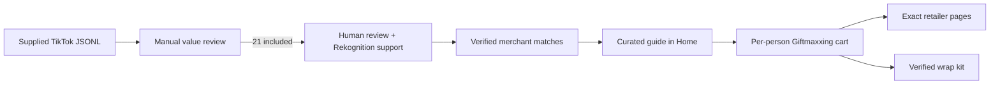

# Curated commerce pilot

This pilot serves one reviewed collection built from the supplied TikTok JSONL
and approved editorial gift-guide carousels. It does not blend or backfill the
legacy product database.

## Curated source set

The current manifest contains 35 source guides, 86 matched products, three wrap
items, and 211 images. Home, Search, Maxi, and both challenge surfaces fail
closed to its active collection version. Swipe contains only approved, directly
purchasable products—not inspiration posts or services. The bundle is the
offline fallback.

Product identity remains stricter than content inclusion. A source without
enough visual evidence is labeled `Inspiration guide` and receives no invented
product match. Cover-only records link back to the original post for context.

The complete evidence and merchant URLs live in
`Giftmaxxing/Resources/curated-gift-journeys.json`.

## Verification boundary

Exact product identity uses two independent checks:

1. A human-readable brand or product name in the source caption/slide.
2. A current official brand or major-retailer product page matching it.

Amazon Rekognition adds object labels and OCR evidence, but it is not treated as
a product search engine. A generic label such as `Backpack` cannot prove that an
image is an Arc'teryx Mantis 26.

Run the audit after AWS SSO login:

```bash
AWS_PROFILE=dev_sso_giftmaxxing \
AWS_REGION=us-east-1 \
npm --prefix infra/ingest run curate:tiktok -- \
  --file /Users/tarive/Downloads/dataset_tiktok-profile-scraper_2026-08-11_21-42-15-426.jsonl
```

The report is written to
`infra/ingest/reports/tiktok-curation-pilot.json`. The script fails closed if an
approved post is absent from the JSONL and never writes DynamoDB.

Publish the already-reviewed manifest after the API deployment. The active
pointer changes only after every media, post, entity, and edge write succeeds:

```bash
AWS_PROFILE=dev_sso_giftmaxxing AWS_REGION=us-east-1 \
npm --prefix infra/ingest run publish:editorial-curation -- --apply
```

Dry run is the default. Publishing uploads immutable media and writes the exact
source guides/products to `posts`, `catalog_entities`, and `catalog_edges`.

## Purchase behavior

| Merchant | What the app promises | Verified capability |
|---|---|---|
| Target | Open the exact product | Add to cart, pickup, same-day delivery, shipping |
| Michaels | Open the exact product or tightly filtered first-party listing | Add to cart, pickup, shipping; ribbon also exposes Buy Now |
| Apple | Configure the gift | Case/band selection, delivery, store pickup |
| Hermès | Choose the size | Volume selection, add to cart, shipping |
| Ralph Lauren | Choose the color | Color selection, add to bag, store finder |
| Nomination | Configure the bracelet | Bracelet configurator and delivery |
| Arc'teryx | Open the exact official product page | Add to cart and delivery |
| Chanel | Open the exact official product | Add to bag and shipping |
| Fjällräven | Choose a backpack color | Color selection, add to cart, shipping |
| Hydro Flask | Choose a bottle color | Color selection, add to cart, shipping |
| Aesop | Choose a balm size | Size selection, add to cart, shipping |

The Onitsuka Tiger slide remains useful inspiration, but it is intentionally
unlisted as a product: no exact, live US purchase page could be verified. The
pilot prefers a visible supply gap over a generic or misleading store link.

The app says “Open,” “Choose,” or “Configure.” It does not claim that a product
was added to a third-party cart. The Giftmaxxing cart is the cross-merchant
checklist; each retailer remains the source of truth for stock, variants, tax,
and fulfillment.

## App flow



## Scale only after the pilot works

Track source-guide opens, product opens, adds to a Giftmaxxing cart, completed
retailer check-offs, wrap-kit adds, and hides. Expand the source set only after
the four guides show useful downstream behavior. At scale, keep the same gates:
human approval, immutable source evidence, product-page availability checks,
and a hard separation between inspiration and verified commerce.

Attributed Mixer impressions, dwell, likes, comments, saves, hides, offer
clicks, and purchases make good/bad content observable. Generate the operator
report with:

```bash
AWS_PROFILE=giftmaxxing_dev_cursor_cloud AWS_REGION=us-east-1 \
npm --prefix infra/ingest run report:content -- --days 30 --out content-performance.json
```
