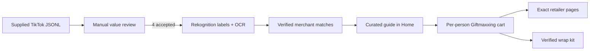

# Curated commerce pilot

This pilot starts with one supplied TikTok JSONL export. It does not read,
blend, rank, or backfill the existing product database.

## What was accepted

| Source post | Why it earned a place | Product role |
|---|---|---|
| `7670641859131100430` | Strongest response in the export and an original personalization rule | Italian charm bracelet and memory-box supplies |
| `7670641318242077966` | Reusable basket formula: hobby + upgrade + comfort + plan | Three exact Target products visible in the basket |
| `7672135662056869133` | Named products with a reason for each recommendation | Four products verified against official brand stores |
| `7670644980880248077` | Completes the gift after purchase with concrete presentation rules | First-party Michaels wrap kit |

The remaining export posts were rejected for this pilot. High engagement alone
does not override generic collage content, duplicated advice, unclear product
identity, or low-information reaction videos.

The complete evidence and merchant URLs live in
`Giftmaxxing/Resources/curated-gift-journeys.json`.

## Verification boundary

Exact product identity uses two independent checks:

1. A human-readable brand or product name in the source caption/slide.
2. A current official brand or major-retailer product page matching it.

Amazon Rekognition adds object labels and OCR evidence, but it is not treated as
a product search engine. A generic label such as `Backpack` cannot prove that an
image is an Arc'teryx Mantis 26.

Run the audit after AWS SSO login:

```bash
AWS_PROFILE=dev_sso_giftmaxxing \
AWS_REGION=us-east-1 \
npm --prefix infra/ingest run curate:tiktok -- \
  --file /Users/tarive/Downloads/dataset_tiktok-profile-scraper_2026-08-11_21-42-15-426.jsonl
```

The report is written to
`infra/ingest/reports/tiktok-curation-pilot.json`. The script fails closed if an
approved post is absent from the JSONL and never writes DynamoDB.

## Purchase behavior

| Merchant | What the app promises | Verified capability |
|---|---|---|
| Target | Open the exact product | Add to cart, pickup, same-day delivery, shipping |
| Michaels | Open the exact product or tightly filtered first-party listing | Add to cart, pickup, shipping; ribbon also exposes Buy Now |
| Apple | Configure the gift | Case/band selection, delivery, store pickup |
| Hermès | Choose the size | Volume selection, add to cart, shipping |
| Ralph Lauren | Choose the color | Color selection, add to bag, store finder |
| Nomination | Configure the bracelet | Bracelet configurator and delivery |
| Arc'teryx | Open the exact official product page | Add to cart and delivery |

The Onitsuka Tiger slide remains useful inspiration, but it is intentionally
unlisted as a product: no exact, live US purchase page could be verified. The
pilot prefers a visible supply gap over a generic or misleading store link.

The app says “Open,” “Choose,” or “Configure.” It does not claim that a product
was added to a third-party cart. The Giftmaxxing cart is the cross-merchant
checklist; each retailer remains the source of truth for stock, variants, tax,
and fulfillment.

## App flow



## Scale only after the pilot works

Track source-guide opens, product opens, adds to a Giftmaxxing cart, completed
retailer check-offs, wrap-kit adds, and hides. Expand the source set only after
the four guides show useful downstream behavior. At scale, keep the same gates:
human approval, immutable source evidence, product-page availability checks,
and a hard separation between inspiration and verified commerce.
