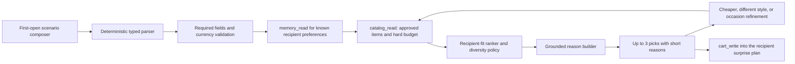

# Maxi preset gift scenario

The first-open shortcut should let someone state one complete gifting job,
then receive up to three evidence-backed products without browsing first.

Example: “Birthday gift for my 25-year-old friend; she likes minimalist design;
budget CNY 300.” The UI may start as natural language, but it must normalize to
a typed value before retrieval:

```ts
type GiftScenario = {
  recipient: { relationship: string; age?: number; name?: string };
  occasion: string;
  budget: { minorUnits: number; currency: string };
  interests: string[];
  exclusions: string[];
};
```



## Orchestration contract

- Keep Maxi at the existing seven typed tools. A scenario is request context,
  not an eighth tool.
- The client sends the normalized scenario with the existing Maxi request.
  The server may use `memory_read`, but writes only facts the user explicitly
  confirms through `memory_write`.
- Convert currency with a versioned server exchange-rate snapshot; enforce the
  budget before model reasoning. “Cheaper” must remain a strict upper bound.
- `catalog_read` returns only approved products with live offers, archived
  primary media, short descriptions and evidence timestamps.
- The mixer selects different categories or merchants when equally relevant.
  Return fewer than three rather than insert an unrelated product.
- Reasons are assembled from explicit evidence slots: recipient preference,
  occasion fit, price fit and product capability. The model cannot add claims.
- `cart_write` happens only after an explicit “prepare this” action and stores
  the recipient/occasion with exact catalog IDs.

## First-open surface

Show four compact fields—who, occasion, budget and one optional preference—plus
a natural-language input. Offer local examples such as “best friend birthday”
or “new-home gift,” but never pre-fill demographic stereotypes. After the
three picks, the next actions are `Prepare this surprise`, `Show cheaper`, and
`Change the vibe`.

## Release tests

1. Parser fixtures for age, relationship, occasion and currencies.
2. A 100% hard-budget gate, including strict cheaper-than refinements.
3. Every reason claim maps to a catalog evidence field.
4. Exactly three only when three relevant eligible items exist; otherwise
   honest underfill or one clarifying question.
5. Ten taste personas plus anonymous baseline, with recipient-fit and merchant
   diversity judgments.
6. Prompt-injection, stale-offer, missing-image and conflicting-budget cases.
7. Tool traces contain only the seven approved tool names.
