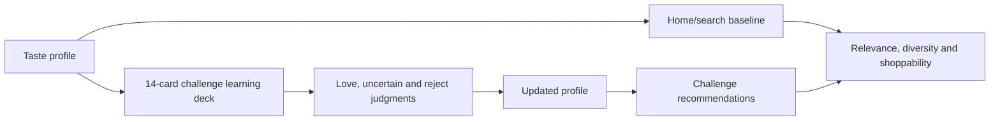

# Recommender evaluation

The harness evaluates ten fixed personas so every model and policy version sees the same taste, budget, content-kind, Home taxonomy, search, and challenge matrix.

## Run

```bash
AWS_PROFILE=giftmaxxing_dev_cursor_cloud \
AWS_REGION=us-east-1 \
node infra/eval/seed-personas.mjs --viewer-user-id USER_ID
```

```bash
MIXER_API_URL=https://API_HOST \
MIXER_TOKEN=TOKEN \
node infra/eval/run-recommender-eval.mjs \
  --personas all --surfaces all --repeat 3
```

```bash
node infra/eval/render-report.mjs \
  --run infra/eval/runs/RUN_ID.json
```

The run writes JSON, a CSV judgment sheet, and an HTML card grid. Fill `human_relevance_0_1_2` with `0` irrelevant, `1` plausible, or `2` strong. Keep raw beta-user events in AWS; evaluate only consenting profile IDs and export aggregate metrics.

## Matrix and gates

Each persona gets three For You sessions, every server taxonomy theme and tag, representative positive/budget/negative searches, an anonymous baseline, a 14-card learning deck, simulated decisions, and post-challenge recommendations.



Review Precision@10, NDCG@10, direct/bridged rate, kind distribution, merchant/category diversity, duplicates, unavailable items, anonymous lift, cross-persona top-20 overlap, and challenge improvement. A valid learning deck has exactly 14 unique cards, at least four categories and three price bands when supply permits, product/service contrast when available, and no merchant/category run longer than two. The target post-challenge relevance improvement is at least 10%.

Supply failures must be labeled separately from policy failures. Low UGC/story inventory is a supply problem; enough eligible supply with a missed quota is a ranking-policy problem.

## Candidate gate

Upload or copy the completed 10-person report to `s3://$RECOMMENDER_ML_BUCKET/evaluations/MODEL_VERSION.json`, then run:

```bash
infra/ml/.venv/bin/python infra/ml/evaluate_candidate.py --candidate MODEL_VERSION
```

Only a passing `MODEL_VERSION-gate.json` can be promoted. A failed evaluation leaves the candidate pending and production unchanged.
