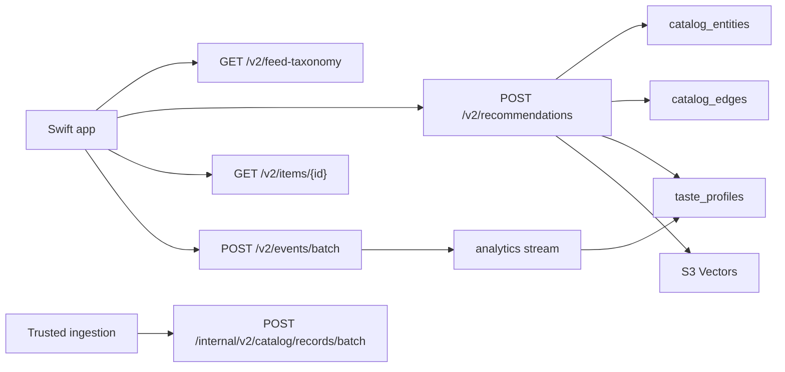
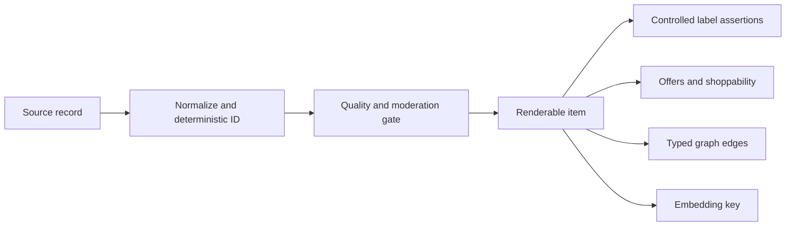
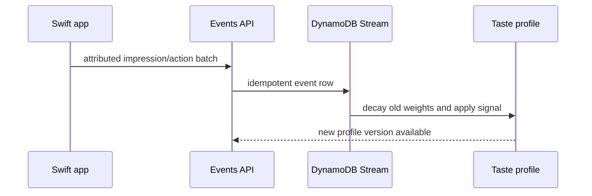
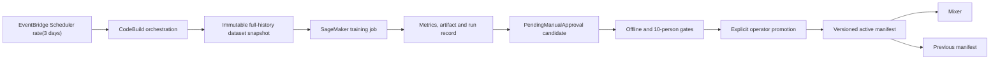

# Recommender Mixer v2

Mixer v2 is the server-authoritative ranking path for Home, pills, search, challenge learning, and recipient recommendations. The deterministic/cosine policy is the initial production champion. A learned candidate is used only after every gate passes and an operator promotes it.

## API map



## Recommendation request

```mermaid
flowchart LR
  Request["Authenticated request"] --> Validate["Validate surface, subject and constraints"]
  Validate --> Auth["Authorize subject profiles"]
  Auth --> Retrieve["Vector, catalog, graph, fresh and popular retrieval"]
  Retrieve --> Score["Relevance, taste, commerce, quality, freshness, exploration"]
  Score --> Model["Optional manually approved model blend"]
  Model --> Policy["Surface policy and diversity constraints"]
  Policy --> Response["Ranked typed items and signed attribution"]
```



`surface` is one of `home`, `search`, `challenge_learn`, or `challenge_recommend`. Actor identity always comes from authentication. A caller may use only owned or explicitly shared `profileIds`.

Home first-page policy targets 50–70% products/services, at least 15% UGC and 10% story/generated supply when available, at least 85% direct/bridged shoppability, no duplicates, and no run longer than two from one kind, merchant, or creator. Admin `debug: true` responses include supply counts so shortage and ranking failures can be separated.

## Catalog primitives



Renderable kinds are `product`, `service`, `ugc_post`, `story`, and `generated_media`. `scraped`, `retailer`, `ugc`, `editorial`, and `ai` describe provenance. Shoppability is `direct`, `bridged`, or `inspiration_only`.

## Continuous learning



The stream projection updates positive/negative items, label and kind weights, preferred price, uncertainty, confidence inputs, and version. Conditional writes plus processed event IDs make retries idempotent.

## Training, promotion, rollback



Training runs unconditionally every three days. It uses every valid historical label with a 90-day half-life. A head without both classes is recorded as excluded; if no viable head remains, the SageMaker run completes without a candidate. Training never changes `models/active.json`.

Promotion requires a positive bootstrapped 95% lower bound, no regression above 2% in shoppability/diversity/coverage/safety/latency, successful synthetic and shadow reports, and the manual command. Rollback restores the previous active manifest without retraining or API deployment.

## Swift behavior

Home and search call Mixer first and retain the legacy path only as an offline/error fallback. Home passes stable theme/tag IDs. The device persists up to 24 cards, immediately paints cache younger than 24 hours, retains it for seven-day offline recovery, and never reorders cards already visible. A version change replaces the next cached page rather than moving visible cards.

## Operations

```bash
npm --prefix infra/src test
terraform -chdir=infra validate
```

```bash
python3 -m venv infra/ml/.venv
infra/ml/.venv/bin/pip install boto3 numpy
infra/ml/.venv/bin/python infra/ml/run_recommender_training.py --reason manual --wait
infra/ml/.venv/bin/python infra/ml/evaluate_candidate.py --candidate MODEL_VERSION
node infra/ml/promote-model.mjs --version MODEL_VERSION
node infra/ml/promote-model.mjs --rollback
```

The Scheduler schedule is `rate(3 days)` ([AWS documentation](https://docs.aws.amazon.com/scheduler/latest/UserGuide/schedule-types.html)). Registry versions remain pending until explicitly approved ([AWS documentation](https://docs.aws.amazon.com/sagemaker/latest/dg/model-registry-approve.html)).

## Kill switches and rollout

Deploy storage, stream projection, and shadow evaluation first. Cut over Home, search, challenge learning, then challenge recommendations. If Mixer errors, Swift uses the existing endpoints/cache. If an approved learned model regresses, run rollback; the deterministic champion remains valid and requires no endpoint.
