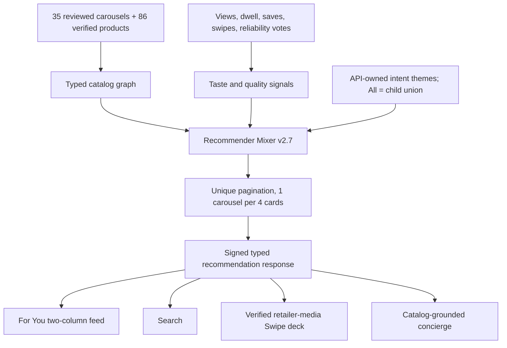
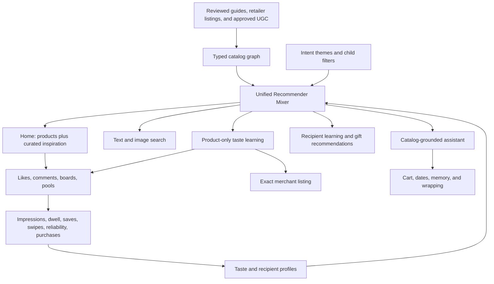

# Swipe product and feed pipeline

## Why cards previously had one image

The curated manifest stored one editorial crop per product. That image is
evidence for product identity, not product-card media. The enrichment pass now
uses OCR/vision evidence to resolve the exact product, then reads the verified
retailer URL, extracts only listing-owned images and features, archives them in
S3, and publishes the gallery in typed `media[]`. A product remains outside
Swipe until at least one retailer-owned image is verified. Header/listicle
slides are inspiration-only and can never enter the product deck.

```mermaid
flowchart LR
  Guide["Reviewed inspiration carousel"] --> Classify["Header, editorial, or product evidence"]
  Classify -->|"Header or editorial"| HomeOnly["Home inspiration only"]
  Classify -->|"Product evidence"| OCR["OCR and visual product parsing"]
  OCR --> Match["Exact product and variant match"]
  Match --> URL["Official retailer listing URL"]
  URL --> Extract["Official API, JSON-LD, or merchant CDN"]
  Extract --> Validate["Identity, image type, size, dedupe, max 8"]
  Validate -->|"Unverified"| Hold["Hold outside Swipe"]
  Validate --> Archive["Versioned S3 media archive"]
  Archive --> Catalog["Catalog item: verified media[], features[], offer"]
  Catalog --> Mixer["POST /v2/recommendations"]
  Mixer --> Swipe["Swipe product gallery"]
  Swipe --> Detail["Swipe up: features and why it fits"]
  Detail --> Shop["Open exact retailer listing"]
```

## API-authoritative feed

## What changes without an App Store release

Catalog contents, ranking, theme and tag names, prices, features, offers,
galleries, and carousel ordering are server data and propagate after cache
revalidation. New gestures, layouts, local persistence, decoding new required
fields, and native capabilities require an app release. The earlier theme
update failed because the API returned `query` while iOS required `terms`; iOS
then correctly used its bundled offline fallback. The contract is now aligned.
The earlier For You implementation also repeated a local first page, which
starved most API carousels; For You now follows the API cursor and stable IDs.

## Application map

