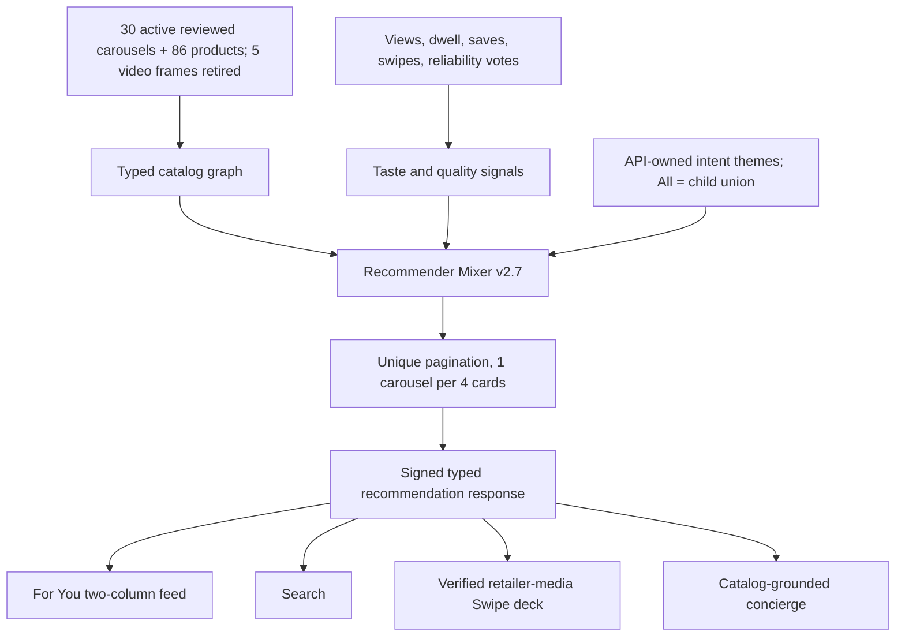
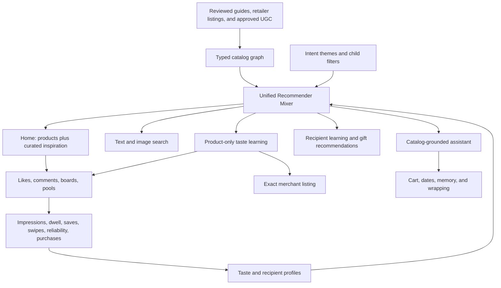

# Swipe product and feed pipeline

## Why cards previously had one image

The curated manifest stored one editorial crop per product. That image is
evidence for product identity, not product-card media. The enrichment pass now
uses OCR/vision evidence to resolve the exact product, then reads the verified
retailer URL, extracts only listing-owned images and features, archives them in
S3, and publishes the gallery in typed `media[]`. A product remains outside
Swipe until at least one retailer-owned image is verified. Header/listicle
slides are inspiration-only and can never enter the product deck.

An active carousel must declare at least two slides. A single exported frame
from a video is archived but rejected by the publisher; it is neither Home
inspiration nor a Swipe product.

```mermaid
flowchart LR
  Guide["Reviewed inspiration carousel"] --> Classify["Header, editorial, or product evidence"]
  Classify -->|"Header or editorial"| HomeOnly["Home inspiration only"]
  Classify -->|"Product evidence"| OCR["OCR and visual product parsing"]
  OCR --> Match["Exact product and variant match"]
  Match --> URL["Official retailer listing URL"]
  URL --> Extract["Official API, JSON-LD, or merchant CDN"]
  Extract --> Validate["Identity, OCR density, dimensions, aspect, dedupe, max 8"]
  Validate -->|"Unverified"| Hold["Hold outside Swipe"]
  Validate --> Archive["Versioned S3 media archive"]
  Archive --> Catalog["Catalog item: verified media[], features[], offer"]
  Catalog --> Mixer["POST /v2/recommendations"]
  Mixer --> Swipe["Swipe product gallery"]
  Swipe --> Detail["Swipe up: features and why it fits"]
  Detail --> Shop["Open exact retailer listing"]
```

## Processing and storage contract

| Stage | Processing | Output and storage | Maxi truth boundary |
|---|---|---|---|
| 0. Upload | `+` creates an identity-bound post and presigned media upload | Raw object: `s3://giftmaxxing-dev-media/ugc/raw/...`; DynamoDB `posts`: `UPLOAD_PENDING`, `AWAITING_MEDIA` | May say only “uploaded” |
| 1. Safety + observation | Rekognition moderation, labels, OCR; observations are not product identity | Approved media: `ugc/public/...`; labels/OCR in `posts.productObservations` | May describe visible evidence with “appears to” |
| 2. Source evidence | Read supplied links; extract retailer title, short description, features, price and gallery | Evidence snapshot in `posts.productObservations.productCandidates`; CloudWatch logs | May quote evidence and source; cannot call it an exact match yet |
| 3. Entity resolution | Compare OCR, brand/model/variant and visual evidence; dedupe to canonical item | Candidate `catalog_entities` + typed `catalog_edges`; ambiguity stays `MANUAL_REVIEW_REQUIRED` | Must abstain on identity conflicts |
| 4. Approval | Human or deterministic high-confidence gate approves exact product and offer | Approval, provenance, review time and offer in DynamoDB | Consumer Maxi reads only approved records |
| 5. Media archive | Reject text-heavy/social banners, images under 0.75 MP or 800 px on the short edge, extreme aspect ratios; rank valid retailer media and cap at eight | `curated/{version}/products/{id}/...` in S3; `mediaQuality[]`, `primaryImage` and typed `media[]` on entity | Describes only archived, provenance-bound media |
| 6. Retrieval | Embed approved title + short description + representative image | 1024-d vector in S3 Vectors; behavior/profile in DynamoDB | Explains retrieval reason, never invents listing facts |
| 7. Serving | Mixer applies eligibility, taxonomy, personalization and availability | Active collection pointer in DynamoDB; signed `/v2/recommendations` | Recommends only IDs returned by tools |

Upload begins stages 0–2 automatically. It does not auto-promote an image-only
guess into Swipe: missing links or ambiguous evidence stop at manual review.
Passing moderation is not the same as passing presentation quality. Safety,
product identity and primary-image eligibility are three separate gates.

## Proposed Maxi evidence views

Keep Maxi's public surface at the existing seven typed tools. Do not add a
general database or web tool. Extend `catalog_read` internally with a typed,
read-only view chosen by the server:

- `approved`: exact item, offer, archived gallery, short description and source
  timestamp; usable for recommendations and factual answers.
- `observation`: OCR and visible labels only; the prompt requires uncertainty
  language and forbids retailer/price claims.
- `candidate`: curator-only evidence comparison; the prompt lists supporting
  and conflicting fields and returns `abstain` when identity is weak.

Maxi never writes catalog status, promotes candidates or accesses raw URLs.
`memory_write` stores user preferences, not product “facts.”

## Platform comparison

| Platform | Strong primitive | Giftmaxxing difference |
|---|---|---|
| TikTok / Instagram | Creator media, captions, engagement and multi-image publishing | A post image is not canonical retailer evidence |
| RedNote | Product/variant/item hierarchy with shared imagery and descriptions | Gift-recipient fit remains a separate problem |
| Pinterest | Inspiration plus catalog-backed Product Pins and landing-page metadata | Product connection depends on merchant evidence, not visual similarity alone |
| ShopMy | Creator-curated outbound product links and conversion attribution | Link curation alone does not establish multi-angle image identity |
| Giftmaxxing | Inspiration + product resolution + recipient taste + exact offer | Evidence first; abstain instead of padding with junk |

## API-authoritative feed

## What changes without an App Store release

Catalog contents, ranking, theme and tag names, prices, features, offers,
galleries, and carousel ordering are server data and propagate after cache
revalidation. New gestures, layouts, local persistence, decoding new required
fields, and native capabilities require an app release. The earlier theme
update failed because the API returned `query` while iOS required `terms`; iOS
then correctly used its bundled offline fallback. The contract is now aligned.
The earlier For You implementation also repeated a local first page, which
starved most API carousels; For You now follows the API cursor and stable IDs.

## Application map

## Swipe learning and reliability labels

Every right/left decision updates the private on-device taste profile first and
is also forced through `/v2/events/batch`, including offline fallback cards.
The server stream updates positive/negative label, category, price and kind
weights. Reliability labels are quality supervision only and carry zero taste
weight.

The first reliability prompt is eligible on card six, after five completed
swipes. Showing the prompt starts a per-user 48-hour cooldown whether or not
the user answers; an already rated product is never prompted again.
