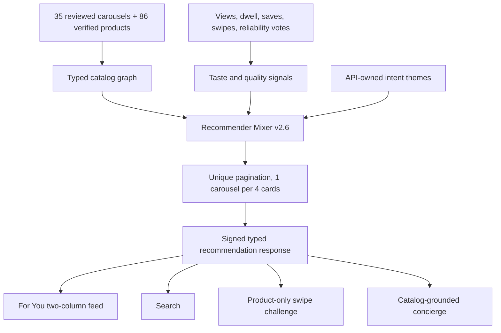

# Swipe product and feed pipeline

## Why cards previously had one image

The curated manifest stored one editorial crop per product. The API normalized
that single value correctly, so the client could not invent a product gallery.
The new enrichment pass reads the exact verified retailer URL, extracts only
listing-owned images, archives them in S3, and publishes the gallery in the
typed `media[]` field. If a retailer exposes one image, the card stays
single-image. No unrelated fallback images are added.

## API-authoritative feed

## What changes without an App Store release

Catalog contents, ranking, theme and tag names, prices, features, offers,
galleries, and carousel ordering are server data and propagate after cache
revalidation. New gestures, layouts, local persistence, decoding new required
fields, and native capabilities require an app release. The earlier theme
update failed because the API returned `query` while iOS required `terms`; iOS
then correctly used its bundled offline fallback. The contract is now aligned.
